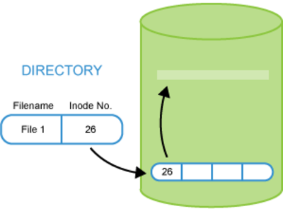
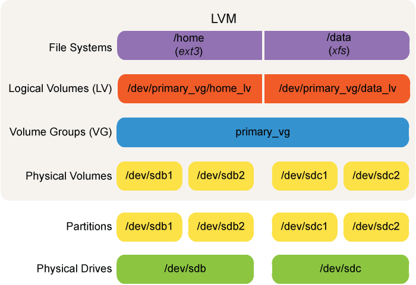

## inodes

- directory file := file name + inode number
- hard link (`ln <src-file> <new-file-name>`) copies directory file with new file name
  - increments inode counter
  - `ls -i` shows inode numbers, `find <path> -inum <number>` finds all files sharing this inode
- soft link (`ln -s <src-file> <new-file-name>`) creates link to directory file

## Virtual File System (VFS)

Abstraction / interface for file systems (read, write, permissions, ...)

Not all vfs are mounted (e.g `/proc` is but _pipefs_ isn't)

## Mounting & Partitioning

- A partition is a physical contiguous region on the disk
- Useful for security management, performance tuning, swapping, ...
- `df -h <path>` displays partition information of path
- Partition tables:
  - **MBR** (deprecated): Master Boot Record, includes boot loader and partition of disk
  - **GPT (GUID Partition Table)**
  - `ls -l /dev` shows device nodes:
    - `sda2` := _sd_ device type, _a_ first hard drive, _2_ second partition
- `lsblk` shows info about block devices (disks, partitions, loop, ...)
- `blkid` wrapper of `libblkid` for working with block devices
- `fdisk /dev/sda` lets you format / partition your disk menu driven (`sfdisk` for use in scripts)
  - virtual device via file:
    - `# dd if=/dev/zero of=loopbackfile.img bs=100M count=10` # creates 1GB file (dd := disk dump)
    - `losetup -fP loopbackfile.img` # uses first free loop device to make given file a device file
    - `losetup -a` shows all loop -> see there which one you got
  - `mkfs.ext4 /dev/sda3` to make this partition to a filesystem
  - `mkdir /mnt/<mountdir>`
  - `mount -t tmpfs none /mnt/<mountdir>` # creates RAM fs with max 50% RAM capacity
  - `mount` # shows all mounts
  - `umount /mnt/<mountdir>`
  - All lines in `/etc/fstab` are mounted at boot or through `mount -a`
- `gparted` for gui-based

## Disk information

- `df` # disk free shows file systems
- `du` # disk usage per file/dir; `$ find . -maxdepth 1 -type d -exec du -shx {} \; | sort -hr`
- OOM Killer:= Out of memory killer
- `dumpe2fs /dev/sda2` shows information last mount count, inode count, used block count, ect
- `tune2fs <fs>` cmd to edit attributes of fs like number of mounts between fs checks

## Disk Encryption

**LUKS** (Linux unified key setup) achieved by `cryptsetup`

1. `fdisk /dev/sda` # creates partition on sda (lets say **sda4**)
2. reboot or `partprobe -s`
3. `cryptsetup luksFormat /dev/sda4`
4. `cryptsetup luksOpen /dev/sda4 <mapper name>`
5. add `secret-disk /dev/sda4` to /etc/crypttab # so that pw is asked on boot
6. `mkfs -t ext4 /dev/mapper/<mapper name>`
7. `mkdir /mnt/encrypted-sda4`, add `/dev/mapper/secret-disk /secret ext4 defaults1 2` to /etc/fstab, mount

## LVM (Logical Volume Management)

Logical Partition spanned over multiple partitions / devices -> makes resizing super easy. Physical partitions are converted into physical volumes. Those are grouped into a volume group and than logical volumes (partitions) can be created from it.

## RAID
