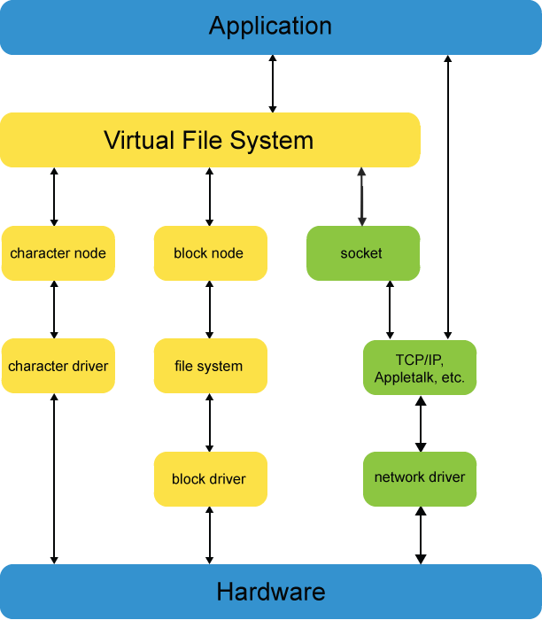

## Main Functionality

- System initialization and boot up
- Process scheduling
- Memory management
- Access to hardware (disks, keyboards, speakers, ...)
- I/O between application and hardware
- Network control

## GRUB (Grand unified Bootloader)

- GRUB can pass arguments to kernel; configured in `/boot/grub/grub.cfg`
  - Arguments not understood by kernel will be passed to _init_ (pid=1)
  - `cat /proc/cmdline` shows cmd which started kernel
  - `man bootparam`

## System init

- **sysctl**
  - Tune kernel parameter at runtime
  - `sysctl -a` shows all parameter, where each entry maps to a pseudofile in `/proc/sys`. Therefore the following two arguments do the same:
    - `sudo sh -c 'echo 1 > /proc/sys/net/ipv4/ip_forward'`
    - `sudo sysctl net.ipv4.ip_forward=1`
  - `/etc/sysctl.conf` can make some settings immutable at runtime
    - `sudo sysctl -p` applies all settings from it, what is part of boot as well -> permanent
- **systemd**
  - (Additional) init system, which handles and utilizes daemons
  - Settings in `/usr/lib/sysctl.d/` which can be supplanted through files in `/etc/sysctl.d.`
  - can be controlled via `systemctl`

## Modules

- Load software into kernel at runtime (e.g. drivers)
- `lsmod` list all currently loaded modules
- `modprobe`
  - loads module and all its dependencies (prebuilt in `/lib/modules/$(uname -r)/modules.dep`)
  - or updates parameter, which can be seen/edited in pseudofile `/sys/module/<name>/parameters`
  - behavior of `modprobe` can be configured through _.conf_ files in `/etc/modprobe.d`
- `modinfo <name>` for infos about a module

## udev (User Device management)

- detects devices during boot and dynamically later on
- device un-/plugged -> kernel sent message to specific netlink socker -> _udevd_ (manages `/dev`) listens to it -> applies `/etc/udev/rules.d/`, `/run/udev/rules.d/`, `/user/lib/udev/rules.d/`
  - example rule: `KERNEL=="sdb", RUN+="/usr/bin/my-program"`
- **device nodes** are files within `/dev/` (note networks have no device node)
  
