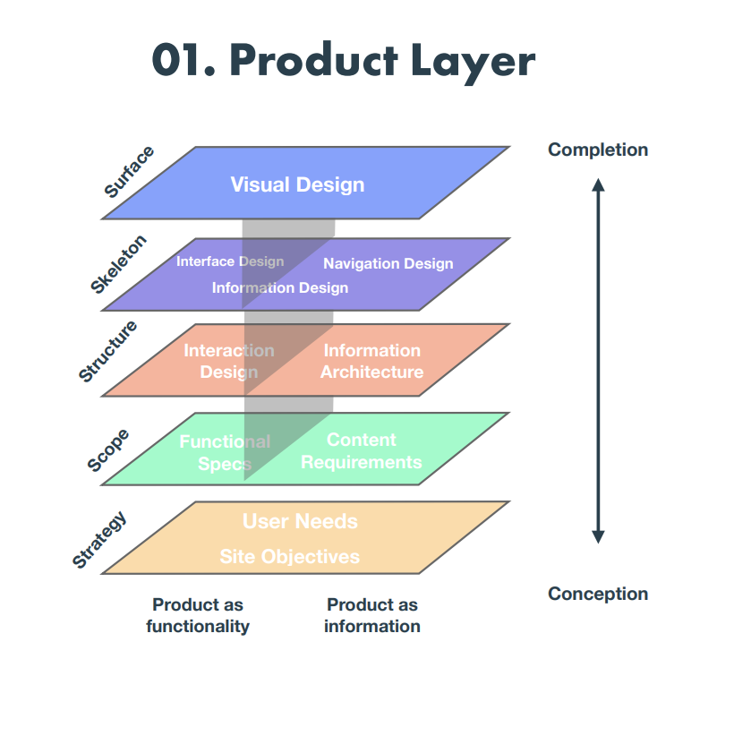

## User Centric

Find out real user needs.

> “If I had asked people what they wanted, they would have said faster horses” (Henry Ford)

## Design thinking

> Matching people's needs with what is technologically feasible and viable as a business strategy. (By Tim Brown)

Empathize -> Define -> ideate -> Prototype -> Test

## Different layers

