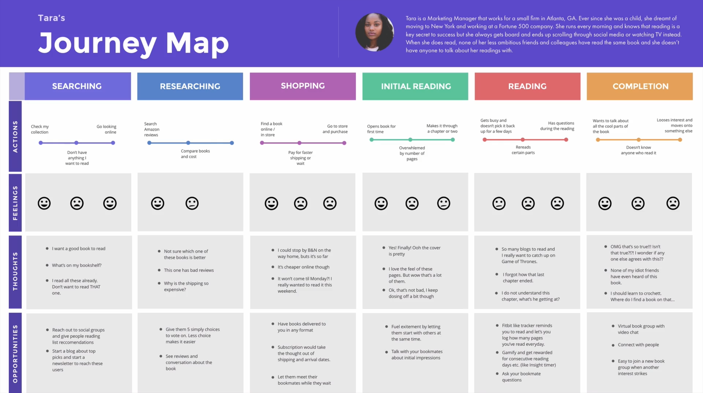

## General

> Trying to please everyone requires to dilute so much what makes your proposition unique that you’ll end up appealing to nobody.

> You don’t find customers for your products. You find products for your customers.

## Jobs to be Done Theory

> 1. People buy products and services to get a “job” done.
> 2. Jobs are functional, with emotional and social components.
> 3. A Job-to-be-Done is stable over time. [Getting from A to B]
> 4. A Job-to-be-Done is solution agnostic. [Not care if horse or car but fast and comfortable]
> 5. Success comes from making the “job”, rather than the product or the customer, the unit of analysis.
> 6. A deep understanding of the customer’s “job” makes marketing more effective and innovation far more predictable.
> 7. People want products and services that will help them get a job done better and/or more cheaply
> 8. People seek out products and services that enable them to get the entire job done on a single platform
> 9. Innovation becomes predictable when “needs” are defined as the metrics customers use to measure success when getting the job done
> [Tony Ulwick](https://jobs-to-be-done.com/the-5-tenets-of-jobs-to-be-done-theory-ba58c3a093c1)

**A new product must be good enough, so that users "fire" their old way and "hire" your product.**

## Lean UX

> Getting Out Of The Deliverables Business [(Jeff Gothelf)](https://www.smashingmagazine.com/2011/03/lean-ux-getting-out-of-the-deliverables-business/)

**Nimble design over heavy wireframes, comps or specs**

Concept -> Prototype -> Validate internally -> Test externally -> Learn from user behavior -> Iterate

Getting feedback is also aligning with team and stakeholder (#TeamSpirit #ExpectationManagement) and putting your work (partially) to a peace of reality, early #NoIvoryTower 

## Competitive SWOT Analysis

Analyse your product / company and your direct competitors (e.g. TikTok and Instagram) and indirect competitors (e.g. TikTok and LinkedIn).

**S**trength  
**W**eaknesses  
**O**pportunities  
**T**hreats  

- Idea of available market
- Idea of potential solutions and your uniqueness #DontReinventTheWheel #BeDifferent 
- Can be used as basis for strategy decisions

## Surveys & User Interviews

**Important for problem space analysis, validate your assumptions, be forced to sort and reflect about your views.**

Phrasing is very important as it will impact answers. It may produce a 20% difference in agreement to a question. For example:

- "The government should force you to pay higher taxes"
- "The government should increase taxes"
- "The government needs to increase taxes"

Or "How would you rate the career of legendary outfielder Joe Dimaggio?" vs "How would you rate the career of baseball outfielder Joe Dimaggio?"

### Funnel technique

- Start with broad, easy to answer questions for "setting the mood"
- Demographic questions last, as they are "boring"
- Allow no answers, especially for demographic answers as users might not want to answer those. Partial information is better than none.

### Keep it short

> How long is too long? The sweet spot is to keep the survey to less than five minutes. This translates into about 15 questions. The average respondent is able to complete about 3 multiple choice questions per minute. An open-ended text response question counts for about three multiple choice questions depending, of course, on the difficulty of the question. While only a rule of thumb, this formula will accurately predict the limits of your survey. [[writing-survey-questions]](https://www.qualtrics.com/blog/)

## Minimum Viable Audience

Minimum + Viable = Smallest possible audience you can serve and that can sustain your business

Example: Community-driven, personalized study music discovery. Designed for busy college students looking for better ways to discover and share new music.

## Empathy Map

> it’s [Empathy] really not sympathy. I think instead it’s recognizing that no one believes what you believe, no one knows what you know and no one wants what you want. And if you can be okay with that as opposed to insisting that you are right and they are wrong (Seth Godin)

Empathy map: (Think and feel, See, Hear, Say, Do Pains, Gains)

- Understand broader influences in our user's live / Practice empathy for our users
- Overview / reference / nice to share with team

## Problem statement

**Persona** needs to **User’s need** because **Insight**

Don't add solutions to problem statement!

## Journey Map

## User Scenario

Good as input for User Stories. Can be derived of User Journey. Should answer the following questions:

- Who is the Persona?
- What is their goal?
- What is the start point?
- What is the trigger/action?
- What is the end point?

### Example Scenario 1

Tara is a marketing manager who wants to find a new book about marketing to help her advance in her career. She has been searching and comparing books online but feels overwhelmed by her options. She usually ends up giving up before buying.

### Example Scenario 2

Tara is learning about new marketing techniques but keeps getting bored and not finishing the book she is reading. She wants to duscuss her reading with others but doesn't know anyone else who has read it.