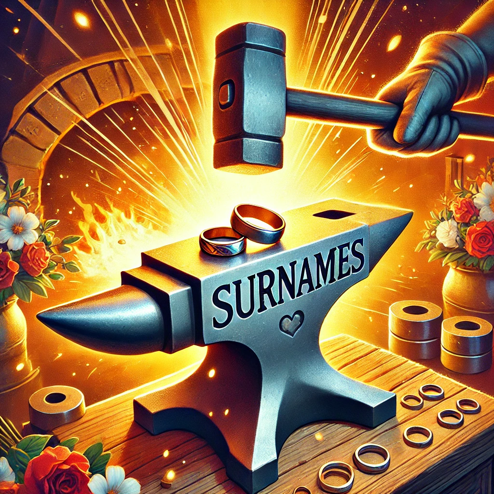

This is my next batch on exercises. Once again, it is not a direct mapping to module's exercises, but I made use of what I've learned so far. As always, feedback is very welcome. 

## Project goals

First I thought about my project goals in the three categories customers, business and technical.

### Customer

Main goal: Find a surname before their wedding

- Gather facts for the emotional surname discussion
- Have a fun experience

### Business (my personal goals)

Main goal: Successfully create own app for wedding and learn new cool stuff

- Plan a product from start
- Deepen my rough UX knowledge
- Deepen my basic UI knowledge
- Contribute a useful tool for all the great people around in the world
- Code a complete product from first line of code to releasing it to real people
- Fulfill the Product Design (UX/UI) Course
- Optional in the far future earn an "extra coffee amount of money" through advertisement or donation for the sake of having made a real product, which earned some money :)

### Technical

I think, based on my experiences as developer so far, that you shouldn't split business goals and technical goals into two separate bubbles.

Nobody will buy your product because you used React instead of Angular as frontend technology, or nobody will ditch your product because it stores its data in a NoSQL-based database instead of an SQL-based database.

On the other hand, you can decide to enter the market as quickly as possible to gain early customer relationship and accept technical debts. Or you can forgo early earnings and invest a lot of time (and money) into a good development process and appropriate technologies & architecture, so that you build a great app and can develop and maintain it over the long term without exploding technical debts and costs over time.

It becomes tricky, when you want to keep your developers happy and having "unsexy" technologies becomes a business risk that you will not find new experienced developers. But in general, I think, it is not a good practice to think of technical aspects as business goals - maybe this will change with more experiences and maybe other will adopt to my opinion - I am curious for future learnings and best practices :)

## Product roadmap

Next, I created a very lean product roadmap.

### Product name and branding

With my finance and ChatGPT as brainstorming partner, we came up with **SurnameForge** as product name.

I love the traditional craftsman spirit and the mental reference to forging a wedding ring. I also like the analogy of iron alloy (mixing words from family and friends) which leads to a stronger forged iron.

The following image is not a defined logo or anything like that, it is just to illustrate the idea and tone:

### Prototype

I created a GitHub Project with a Kanban board [here](https://github.com/users/shaman-apprentice/projects/1/views/1). As soon as all tickets are done, the prototype is ready to use for my own wedding.

It boils down to the following features:
- A welcome screen
- A word cloud
- A survey for getting a feeling for the potential market

Which boils down to a simple app structure as stepper as follows:

### MVP

I created an additional empty GitHub project for an MVP where I only collected ideas in the description.

I think a backlog with too many issues is harmful as it needs to be managed and distracts from the next steps. Also, if the product idea doesn't work, everything worked out for the MVP would be a waste of time and energy #MaximizingTheAmountOfWorkNotDone
