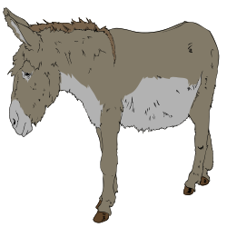

# old-donkey

> Only old Benjamin professed to remember every detail of his long life [...]

> He would say that God had given him a tail to keep the flies off, but that he would sooner have had no tail and no flies

As remembering things is hard, as well as doing things properly, this is a repository to keep some notes of mine accessible everywhere.
