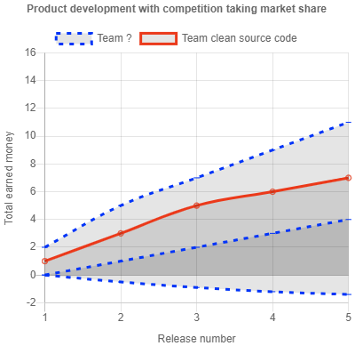

# Seriously? Bad source code! Again?!

A reflection on clean code and business value: Do developers who improve code quality do a better job than developers who leave bad code behind?

## My personal observation

When I dig into new projects for the first time, I always find code smells like classes with more than 500 lines of code, duplicated logic, untested features, logic deeply baked in into an UI component that easily could have been a pure lovely testable function. Is clean code complex rocket science, only mastered by few in the 21st century? Or is clean code just not important? Let's reflect about that.

## What should good source code in the free market do?

When we consider something as bad, it doesn't meet our expectations. When I work with bad source code, my expectation to rapidly implement new features gets disappointed. This makes me feel the company is not earning as much money as it could, due to previous sloppy work.

This leads me directly to the point, **what good source code in the free market should do: Its purpose is simply to earn as much money as possible.**

How does our source code earn money? Mostly some company sells a product. The source code is like a lot of other important stuff part of the product. And in the end our customers and stakeholder have hopefully given us more money, than we have spent on salaries, licenses, marketing, etc., so some money stays in our company.

But wait, so far there wasn't anything about clean code in this section. Is this stuff just not important?

## Some thought experiments

Let's have three simple thought experiments. In the following diagrams the numbers represent an abstract unit of earned money per release. The exact amount is not relevant but only their ratio.

### 1. Product development with one release

Assume we ship a new product. The first team does rapid prototyping and produces a lot of features with sh\*ty code. The second team spends time for building a clean codebase but doesn't ship as many features due to it. Customers pay for the product and not for the internal source code. Meaning the company will likely earn more with the first team.

### 2. Product development with five releases

But our product hopefully lives longer than one release. The second team can likely release new features on a regular basis. Thus increasing customers base. Existing customers are willing to pay more. Both increases revenue steadily. But the first team must fix some bugs. New features take longer time. So, they aren't able to ship as many new features. Their market share doesn't increase as steadily.

### 3. Product development with competition taking market share

Naturally we decide to be the second team. But after our first release there appears a similar product on the market. We start to lose customers and we hardly make any profit anymore 🤯 

Why could the competitor outperform us on the market?

- Did he write cleaner code, allowing him to implement more features than us?
- Did he cut short on clean code for having more times for features? In that case he will probably have to fix a lot of bugs and will need ages for new features in the near future. Not unlikely, frustrated developers will start quitting. Nevertheless, for now he takes away some of our customers and it is unclear, if those will come back later.
- Or maybe they have a better DevOps culture, allowing their overall organization to perform more efficient.
- Or maybe they implemented less features. But they did better market research and their features hit the market better.
- Or maybe they have a bigger team, taking away our customers, but losing money for now.
- Or maybe ...

## Final thoughts

Software development is complex. It is not pure mathematics with a clear correct answer. There are a lot of building bricks you can invest into and it will never be clear what the exact outcome of which investment will be. So you have to make best effort trade offs.

Code quality is an important building block because it helps deliver new features on a regular basis. But overall **I believe the limiting resource of a developer is time. We haven't enough time to invest into everything**. E.g: 
- We could improve code quality reducing average feature cycle time from two to one weeks. That would increase future productivity by about 50%.
- We could also introduce some user data evaluation. If the insights from that enables us to make every second instead of every fourth feature hit, we have increased productivity by about 50% as well. It also helps code quality, as we have fewer features to maintain.

So the existing bad source code may have been a reasonable trade off by a smart team. Regardless, it is now up to us to find benefitting trade offs, whether the previous trade offs were good or not.
