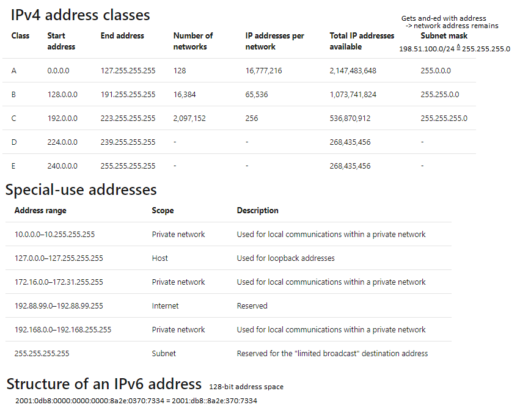

- PAN := Private Are Network - e.g Bluetooth
- LAN := Local Area Network  - home setup (e.g. auth via router)
- WAN := Wide Area Network   - across locations (e.g. over internet)
  
- MAC := Media Access Control address (physical address of device)
IP := Internet Protocol address (on software level)
  
- Bridge := connects two networks as they were one (from eyes of network protocols / routing)
- Hub := Connects multiple devices. Sends all messages to all devices (like an event hub)
- Switch := Bridge ∪ Hub. It can interpret and filter packet data to route directly to target device (via MAC)
  - and optional more features like build virtual sub LANs
- Router (aka gateway) := Links networks together via IP addresses / routing table
  - Routing information along routers is shared via BGP ( := Border Gateway Protocol)
  - Firewall
  - provide DNS
  
- Azure hub-spoke (spoke = Leiter-Sprosse)
  - can connect on-premise and cloud through a VPN gateway or Azure ExpressRoute
- Azure ExpressRoute
  - Dedicated (more performant) VPN gateway hosted by a connectivity partner
  
- UDP := User Datagram Protocol - connection-less -> fast
    - > I've got a really good UDP joke for you, but I don't know you if you will get it
- TCP := Transmission Control Protocol - with connection -> better error detection, re-sent possible, but more header overhead
- Port := Maps incoming messages to a process

Network management protocols := configure and monitor networks
- Azure Network Watcher := Captures data packages
- Network Performance Monitor := health and routes of network
  
- ARP := Address Resolution Protocol - resolves IPv4 -> MAC
- NDP := Neighbor Discovery Protocol - resolves IPv6 -> MAC

### TCP/IP model layers
- **Application layer**: Determine correct protocol, e.g. HTTP, SSL, SSH, ...
- **Transport Layer**: Split application data into packages for used protocol
- **Internet layer**: (aka network layer) Ensures data packages get to destination / handles Network access layer
- **Network access layer**: Defines how data is sent over the network, e.g DSL

IPv4 address := network + host, e.g. 192.168.0.1 (host is .1)

  
- **Azure DNS** - to route your dns (e.g. my.company.com) to an Azure Resource
- **Azure Virtual Network** - build network with subnetting based on IPs

### Server models
- Request-response := E.g. classical web architecture
- Peer-to-peer (P2P) := Each node is potential server and client for each other
- Publish-subscribe := E.g. RSS Feed

### Firewall types
- Application-layer
- Packet filtering
- Circuit-level (before opening of connection checks like date)
- Proxy server (can also cache data, or modify, ...)

### Azure network security tools
- Network Security Group (NSG) := filters traffic for virtual network
- Azure Firewall
- VPN Gateway
