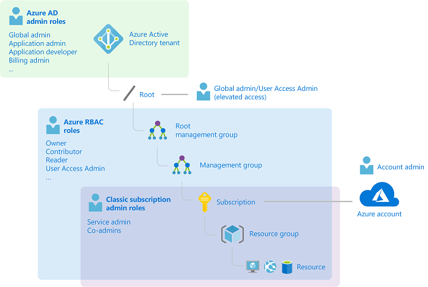

### Single sign-on


### Federated Web Authentication


- Azure AD B2C := App integration
- Azure AD B2B := Invite to tenant (via Mail)
- Switch directory in Portal -> change Active Directory
- Tenant := organization / has an Azure AD instance / an Azure AD has a tenant id
- Subscription n..1 Azure AD
- User n..n Azure AD
- Azure AD _group.membership type_ := assigned or dynamic (rule based)
- User account := type (admin, member, guest) + role assignments + owned objects
- Built-in roles: Owner, Contributor, Reader 
- Azure AD Connect syncs on-premise AD with Azure AD (once, or for hybrid identity)
- SSPR := self-service password reset; can be disabled, enabled, or selected (glued to a security group)
- **AD roles** manage AD resources, like user accounts (only's scope is AD, but global admin can (temporally elevate his access to RBAC user access admin -> can manage resources))- **RBAC** manages Azure resources like VMs
- RBAC scrope levels:


## TODO integrate custom app with application registration

## RBAC
### Role definition
```js
{ 
  "Name": "Contributor",
  "Id": "b24988ac-6180-42a0-ab88-20f7382dd24c",
  "IsCustom": false, // Custom role creation requires Azure AD Premium P1 or P2
  "Description": "Lets you manage everything except access to resources.",
  "Actions": [ "*" ], // read, write, delete, ...
  "NotActions": [ // {Company}.{ProviderName}/{resourceType}/{action}
    "Microsoft.Authorization/*/Delete",
    "Microsoft.Authorization/*/Write",
    "Microsoft.Authorization/elevateAccess/Action"
  ],
  "DataActions": [], // e.g. "Microsoft.Storage/storageAccounts/blobServices/containers/blobs/read"
  "NotDataActions": [],
  "AssignableScopes": [ "/" ] // like subscriptions, resource groups, resources, e.g. "/subscriptions/{sub-id}/resourceGroups/{rg-name}"
}
```

### Role assignment
Assigns / glues a role definition to a security principal (e.g. an user, a group, an application, ...) and a scope (e.g. a resource group or a VM)
