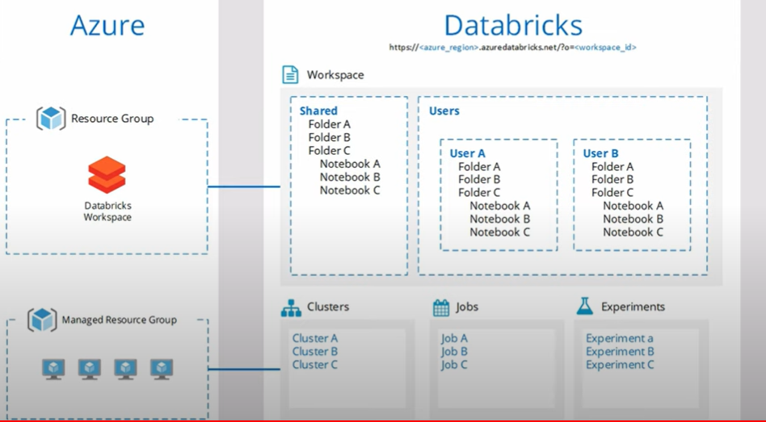

## Azure Databricks
Apache Spark for Azure Cloud / PaaS for huge data processing

- **Notebook** := container for executable cells / scripts
- **Deep learn** := artificial neural network
- **Exploratory data analysis (EDA)** := "unifying" attributes of all data (giving not-existing a null-value)
