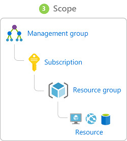

## Cloud deployment models
- public cloud (share resources / hardware)
- private cloud (dedicated resources / hardware, can be on-premise or by third-party)
- hybrid cloud

## Types of cloud services
- IaaS (storage is IaaS)
- PaaS (your own apps deployed into cloud run on PaaS)
- SaaS

## Geo things
- Azure Geographies: Compliance innerhalb geografischer Grenzen
- Azure regions: Reihe von Rechenzentrum mit <= Latenz verbunden
- Availability zones: physich getrennte data center Standorte innerhalb einer region
	 - Not every region has the same features - e.g. has availability zones

## Azure Blueprint
- plan / bundle for resource groups, policies, initiatives, role assignments
- differs to resource manager template (".yaml") in keeping track of deployments and not only creating it (blueprint can contain arbitrary resource manager templates
- definition := what should be deployed, assignment := what was deployed

## Costs
- Pricing Calculator (estimate ahead of time)
- Cost management + advisor (analyse current)
- Total Cost Ownership calculator (on-premise vs cloud based on assumptions)

## General
- on-premise := Der Lizenznehmer kauft oder mietet Software und betreibt diese unter eigener Verantwortung
- CSP := Cloud Solution Provider
- SKU := Stock keeping unit
- Scale up (vertical), scale out (horizontal)
- Economies of scales := price savings due to bigness of cloud provider
- Logic Apps := serverless workflow-based service
- storage account saves each data in at least 3 copies
- Capital expenditure vs Operational expenditure
- App Service Plan := specifies pricing tier, computing, capacity
- Application Gateway := more advanced Load Balancer, cookie affinity, SSL termination, URL rule-based routes, rewrite HTTP headers
- Traffic Manager := redirects to closest healthy target (on DNS level)
- Azure Information Protection := for documents via labels
- Azure Resource Manager := platform for deploying
- Trust center := Website with resource regarding compliance	
	- Trust portal := accompanies Trust center with audit reports etc
	- Compliance Manager; part of Trust portal with workflow-based risk assessment dashboard

