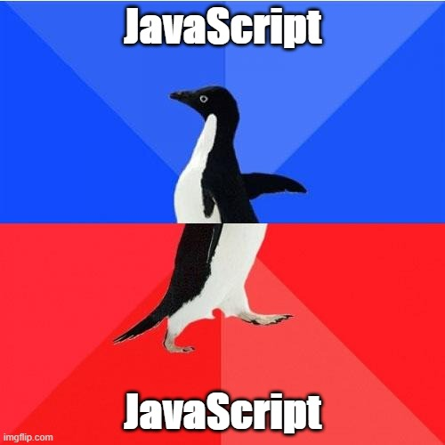

# A trilogy about JavaScript

This is a small trilogy about JavaScript. Part 1 gives context to the annoying past of JavaScript. Part 2 shows that JavaScript has come a long way since then. And in Part 3 I share my experiences with developing some mathematical problems in C, Java, Python and JavaScript.

After all **JavaScript is my programming language of choice** today.

- [Part 1: Annoying past of JavaScript](part-1.md)
- [Part 2: Why JavaScript is definitely a cool thing](part-2.md)
- [Part 3: My personal language challenge _C_ vs _Java_ vs _Python_ vs _JavaScript_](part-3.md)
