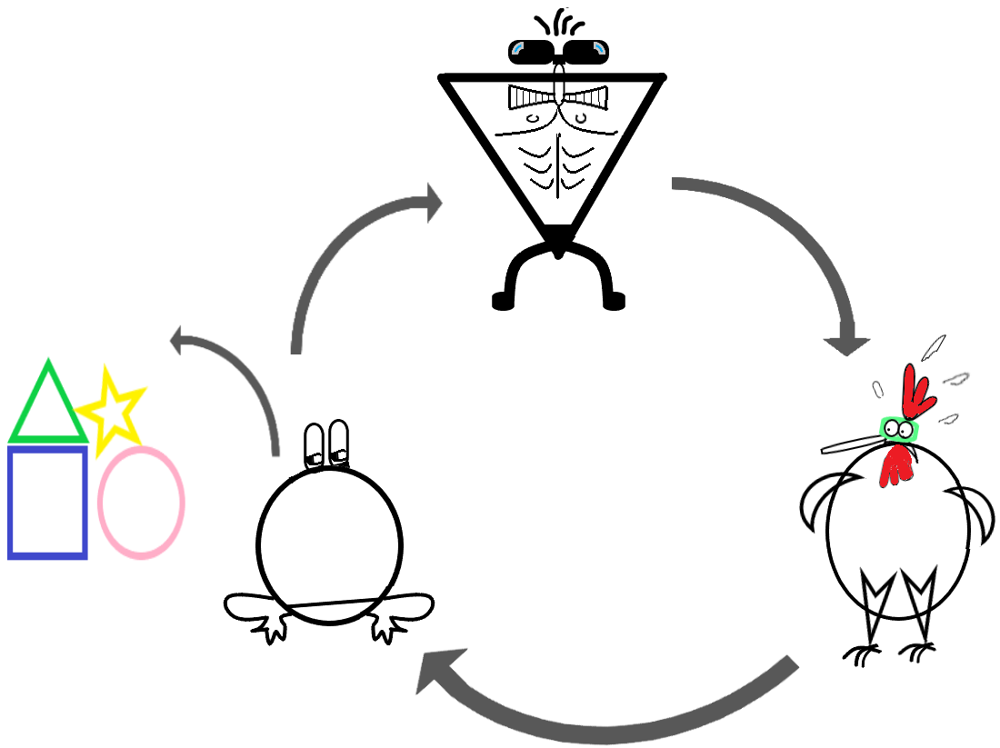



Why are many people reserved about JavaScript? And why is JavaScript nevertheless an excellent choice for your work to get done? This blog is split into the following three parts:

- Part 1: Annoying past of JavaScript
- Part 2: Why JavaScript is definitely a cool thing
- Part 3: My personal language challenge _C_ vs _Java_ vs _Python_ vs _JavaScript_

## Part 1: Annoying past of JavaScript

> **TL;DR:** In the beginning JavaScript development was driven proprietary and on purpose not compatible to competitors.

Starting with the year 1995 the internet was commercialized. Graphical user interfaces (aka browsers) made information and services from servers accessible also for non technicians. A lot of money could be made through installation, support, third party licensing and custom feature implementation for those servers and browsers. With increasing popularity and user accesses advertisement in the browser became a source of revenue as well.[1](#References), [2](#References)

At first browsers offered static content only. As that lacked usability and customization for users, a need for a programming language within browsers arose. In the mid 1995 Brendan Eich was hired by Netscape with the promise, he could implement a Scheme based language for Netscape's browser. But shortly before that Netscape also cooperated with Sun Microsystems to integrate Java into its browser. To convince his superior to bet on a scripting language, Eich created MOCHA within 10 days. As a marketing trick MOCHA was renamed to JavaScript for associating it with at that time trendy Java. Eich described the goal of JavaScript as followed:

> "We aimed to provide a “glue language” for the Web designers and part time programmers who were building Web content from components such as images, plugins, and Java applets. We saw Java as the “component language” used by higher-priced programmers, where the glue programmers — the Web page designers — would assemble components and automate their interactions using JS."[3](#References)

So in its birth JavaScript was a quick and dirty propriety invention by Netscape.

Although JavaScript was created quick and dirty, it was a huge success and competitive advantage for Netscape. To keep up Microsoft reversed engineered JavaScript in JScript for its Internet Explorer. Other competitive proprietary solution to make the browser more dynamic arose like VBScript, Silverlight, Flash, ... 

Probably everyone has heard about this competition in some way as [browser war](https://www.google.com/search?q=browser+war). Basically JavaScript was an important weapon in this war. I like to describe the war with the following kind of repeating circle:

At the top we have a player who thinks is winning. He develops non standard language feature on purpose, as he thinks that this adds cool features and increases the vendor lock-in, which hardens its market position. But then they realise to the right, that user gets frustrated due to the many different user experiences. In addition developing becomes more and more slower, expensive and frustrating. Therefore all competitors agree to work together on some standards, provisioned by the W3C and the ECMA organization. But making a standard is a slow process. Implementing some of the standards before finalization and adding cool features on top of them, promise a competitive advantage. Sounds smart but leads us back to the top of the circle. Luckily on each circle also some cool finalized and agreed on standardized features manage the jump out of the circle. 

To put it in a nutshell, JavaScript needed some circles to evolve from its early quick and dirty proprietary origin, to a mature, multi paradigm and open standard programming language, which it has become today. From a developer point of view, the different phases keeping backwards compatibility in mind is a lot to keep up with. [How it feels to learn JavaScript in 2016](https://hackernoon.com/how-it-feels-to-learn-javascript-in-2016-d3a717dd577f) is a lovely article caricaturing the frustration of it.

**A quick word about Node.js**: In 2009 Ryan Dahl created Node.js at Joyent. He chose to utilise JavaScript, as it lacked in its I/O model. From his point of view he chose the worst language for developing his goal, to make sure that he doesn't create yet another approach. After some iterations Node.js has become stable, widely adopted and open sourced governed since 2015 by the the Node.js Technical Steering Committee.[4](#References)

**A quick word about WebAssembly** (WASM+WASI): In 2019 W3C officially launched WebAssembly as the fourth native Web technology beside HTML, CSS and JavaScript. At its core WebAssembly is a virtual instruction set architecture. Beside enabling high performance it allows to cross-compile code from other languages into the JavaScript stack. That makes it possible to utilize a lot of existing technologies and libraries in the JavaScript context.[5](#References)

### Final remark

After this exhausting journey about JavaScript's past, allow me to finish with two refreshing quotes:

1. JavaScript founder Eich likes to finish his talks with the following slide, stating that JavaScript so far has mastered every obstacle and probably will continue to do so: (todo)[6](#References)
2. Docker co-founder Solomon Hykes twittered in March 2019:
    > If WASM+WASI existed in 2008, we wouldn't have needed to created Docker. That's how important it is.[7](#References)

## References

1. "eBusiness a complete text" by Colin J Holcombe 2016, chapter 2.4 
2. https://www.quora.com/How-did-Netscape-Navigator-make-money, accessed on December 2020
3. Brendan Eich in interview “The A–Z of Programming Languages: JavaScript,” Computerworld, July 30, 2008
4. "LEARNING Node.js" snd edition by Marc Wandschneider 2017, page 2 ff
5. https://www.w3.org/2019/12/pressrelease-wasm-rec.html.en
6. 
7. https://twitter.com/solomonstre/status/1111004913222324225
