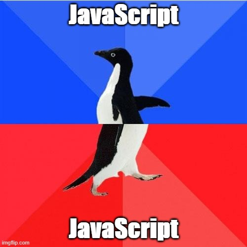

Why are many people reserved about JavaScript? And why is JavaScript nevertheless an excellent choice? This blog is split into the following three parts:

- Part 1: Annoying past of JavaScript
- Part 2: Why JavaScript is definitely a cool thing
- Part 3: My personal language challenge _C_ vs _Java_ vs _Python_ vs _JavaScript_

**TL;DR:** In the beginning JavaScript development was driven proprietary and on purpose not compatible to competitors.

## Part 1: Annoying past of JavaScript

Starting with the year 1995 the internet was commercialized. Graphical user interfaces (aka browsers) made information and services from server accessible also for non technicians. A lot of money could be made through installation, support, third party licensing and custom feature implementation for those servers and browsers. With increasing popularity and user accesses advertisement in the browser became a source of revenue as well.[1](#1), [2](#2)

At first browsers had only pure static content. As this lacked usability and customization for users, a need for a programming language within browsers aroused. In the mid 1995 Brendan Eich was hired by Netscape with the promise, he could implement a Scheme based language for Netscape's browser. But shortly before that Netscape also cooperated with Sun Microsystems to integrate Java into its browser. To convince his superior to bet on a scripting language, Eich created MOCHA within 10 days. As a marketing trick MOCHA was renamed to JavaScript to associate to successful Java. Eich described the goal of JavaScript as followed:

> We aimed to provide a “glue language” for the Web designers and part time programmers who were building Web content from components such as images, plugins, and Java applets. We saw Java as the “component language” used by higher-priced programmers, where the glue programmers—the Web page designers—would assemble components and automate their interactions using JS.[3](#3)

So in its birth JavaScript was a quick and dirty propriety invention by Netscape.

-------------------------------------
Other competitive proprietary solution to make the browser more dynamic aroused like Java Applets, VBScript, JScript, Silverlight, Flash, ... (http://www.observationalhazard.com/2018/06/history-of-web-programming.html).

The programming language for browsers was an import part of the browser wars, which from developer perspective I like to describe with the following circle:

- Browser War "circle"
  - vender lock in nänänä -> diversity hinders developments -> please give us standards - slow but awesome -> a: some lessens learned, b: back to start
    - css art
    - Node.js (because JS was the worst language)
    - Refactoring Vorwort "not admire to JS"
    - Although ECMA, backwards compatibility, new frameworks / tools... [How it feels to learn JavaScript in 2016](https://hackernoon.com/how-it-feels-to-learn-javascript-in-2016-d3a717dd577f)

- Never bet against JS quote
- With WebAssembly no docker needed

", Netscape collaborated with hardware and software company Sun (since bought by Oracle) to include its more static programming language, Java, in Navigator" http://speakingjs.com/es5/ch04.html

We aimed to provide a “glue language” for the Web designers and part time programmers who were building Web content from components such as images, plugins, and Java applets. We saw Java as the “component language” used by higher-priced programmers, where the glue programmers—the Web page designers—would assemble components and automate their interactions using [a scripting language].

"The appeal of Node.js for JavaScript programmers goes beyond being able to program in a familiar language; you get to use the same language on both client and server. That means you can share more code (e.g., for validating data) and use techniques such as isomorphic JavaScript. Isomorphic JavaScript is about assembling web pages on either client or server, with numerous benefits: pages can be rendered on the server for faster initial display, SEO, and running on browsers that either don’t support JavaScript or a version that is too old. But they can also be updated on the client, resulting in a more responsive user interface." ( http://speakingjs.com)

- <id name="1">http://www.ecommerce-digest.com/history-of-the-internet.html, December 2020</id>
- <id name="2">https://www.quora.com/How-did-Netscape-Navigator-make-money, December 2020</id>
- <id name="3">(3) Brendan Eich in interview “The A–Z of Programming Languages: JavaScript,” Computerworld, July 30, 2008</id>