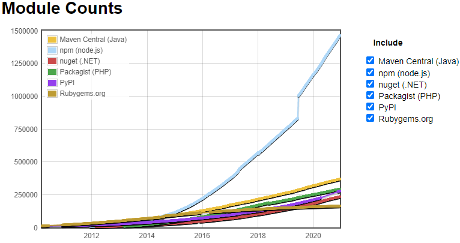

# Part 2: Why JavaScript is definitely a cool thing

1. JavaScript is cool according to surveys
2. JavaScript is cool for businesses and developers
3. Example development with JavaScript

## 1. JavaScript is cool according to surveys

According to _State of the Developer Nation survey_[1](#References) JavaScript (including TypeScript) is the most popular programming language by far. This coincides with results from _Stack Overflow's 2020 survey_[2](#References) that
- JavaScript is the most used programming language and TypeScript is in the top 10.
- TypeScript is the second most loved programming language and JavaScript is in the top 10.
- Node.js is at the top of used miscellaneous frameworks, libraries and tools.

According to GitHub's yearly octoverse study[3](#References) JavaScript is the most used language in GitHub repositories and TypeScript could improve its ranking from seventh to fourth place in 2020.

Another survey commissioned to an independent market research firm by Node.js[4](#References) concludes that Node.js has
- increased developer productivity by 68%.
- reduced development costs by 56%.
- increased application performance by 48% and uptime by 24%.

## 2. JavaScript is cool for businesses and developers

Before reasoning about advantages of JavaScript's ecosystem, lets think about our goals. At first I thought about splitting the goals into two parts: **Why JavaScript a cool thing for businesses** and **Why JavaScript is a cool thing for me as developer by hearth**. But both perspectives come somehow down to the same three points:
- **We want to develope as fast as possible:**
    - That reduces business' time to market, which enables creation of revenue earlier. But even more important it includes and binds customers earlier in today's highly competitive software market.
    - As a developer by hearth this makes me feel productive and good.
- **We want to get customer feedback as early and as often as possible:**
    - For the business it reduces chances of developing something, what the user are not going to need or like.
    - As a developer by hearth early customer feedback improves my software design. This might sound surprising at first. But it forces me to develop and build smaller parts, so I can present them to the customer. Smaller software parts are in general a good thing. It also reduces the chance of unexpected new requirements short before deadlines, which don't fit into current software design, but have to be implemented quickly.
- **We want to be confident in the stability of our built software:**
    - As a business I don't want to alienate customers.
    - As a developer by hearth I want to develop new features and not spent all my time with debugging bugs.

So how does JavaScript's ecosystem support those goals?
- [NPM](https://www.npmjs.com/) has the most amount of packages.[6](#References) Each package I have to not develope myself obviously increases development speed. It also reduces chances for bugs. Many of those packages are used and therefore also tested by a huge number of developers.

- As survey shows JavaScript is very popular. Therefore there is a huge community answering questions e.g. on StackOverflow. There are also many good blogs about technologies and best practices related to JavaScript. Development speed benefits from both points.
- While JavaScript in its beginning was a not well designed language, it has come a long way. All of the following points help me to develop fast and increase my confidence in the stability of the build software:
    - For getting started quickly with a prototype, which I can show to users for first valuable feedback, I can use plain hacky JavaScript.
    - If a project grows I can migrate to TypeScript profiting from strong types and new programming features like optional chaining or type inference. Also in contrast e.g. to Java JavaScript has treated functions always as first class members. Functional programming in JavaScript feels much less clumsy than in Java.
    - JavaScript and TypeScript are awesome for Unit Tests. There are many things which make Unit Testing hard like mocking. Of course the first goal should be to improve design, so that writing Unit Tests loses its pain[5](#References). But specially in legacy projects this can be a long and exhausting journey. In JavaScript's ecosystem it is easy to mock objects and functions. Even classes and imports can be mocked easily, what decreases the pain of getting started with tests.
- As JavaScript is an interpreted language, I don't have to compile or build my program. I can execute it and see the results directly. But for building complex programs, I often appreciate a build tool at some point. JavaScript's ecosystem has many lightweight and blazing fast build tools like [webpack](https://webpack.js.org/). Below [xkcd](https://xkcd.com/303/) is something I experienced while developing Java but is a complete unknown feeling to me, when developing in JavaScript's ecosystem. Not having to wait for compile processes helps me to stay focused on the business logic and to develop faster.

- I like to call JavaScript the "new Java", as it runs literally everywhere. It runs not only in browsers, but also in desktop apps, on servers, on Androids, on IPhones, coffee machines and so on. When shifting e.g. between frontend and backend development, I don't have to shift my mind between different programming languages. I can also easily share common code and types, reducing development and maintenance effort.

## 3. Example development with JavaScript 

Below is a simplified example of a webpage developed in React and a Node.js server. The webpage and the server have a bug each, which are already caught by two failing tests. I can fix the code and see immediately afterwards that the tests pass 😍 The software also gets build immediately, so that I can see it in real immediately 😍 (Random knowledge: "_Two plus two is four. Minus one that's three, quick maths_", is taken from the lyric's [Man's not hot](https://www.youtube.com/watch?v=k3jlviX88iw) 😂)

## References
1. [State of the Developer Nation Q3 2020 survey](https://slashdata-website-cms.s3.amazonaws.com/sample_reports/y7fzAZ8e5XuKCL1Q.pdf)
2. https://insights.stackoverflow.com/survey/2020
3. https://octoverse.github.com/
4. https://nodejs.org/en/user-survey-report/
5. http://www.modulecounts.com/ (accessed in December 2020)
6. Talk "_the deep synergy between testability and good design_" by Michael Feathers, https://www.youtube.com/watch?v=4cVZvoFGJTU
