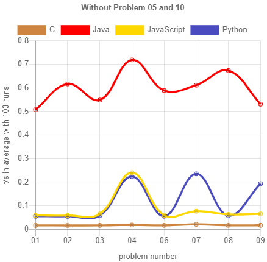

# My personal language challenge _C_ vs _Java_ vs _Python_ vs _JavaScript_

The starting point for this blog entry was, that someone claimed JavaScript is a slow language. Someone else claimed, that programs in modern JavaScript are as blazing fast as programs natively written in C. I personally think, that performance in normal applications isn't of relevance anymore, as hardware has become amazingly fast nowadays.

Back in my study times I solved [ProjectEuler problems](https://projecteuler.net/about). These are mathematical problems, which should be solved programmatically. I remember that some of my solutions took quite some calculation time. So I took the fun to implement a view problems again in C, Java, Python and JavaScript and compare the performance as well as my personal developer experience.

The source code for my solutions is available on GitHub [here](https://github.com/shaman-apprentice/project-euler). I used the same algorithm idea for all languages, but utilizing some nice specific language features, e.g. like Python's list comprehension. I did not try to squeeze out maximal performance but solved a problem in JavaScript and when I was satisfied with the solution, I transferred the algorithm to the other languages. The source code used for evaluation is available on GitHub [here](https://github.com/shaman-apprentice/old-donkey/tree/main/whyJSBlog/euler-evaluation).

This blog entry is split into the following two parts:
1. [Performance analysis](#Performance-analysis)
2. [My developer experience](#My-developer-experience)

## 1. Performance analysis

  
Performance is a complicated topic!

  The following are just some basic thoughts about performance:

  First of all you have to define your performance goals. For Example if you have a function as a service, the startup time of a Java VM might be to slow for you (and a full Java VM in general is probably also more expensive in its resource usage than an interpreted language). But if you have a server running 24/7, startup time is of no concern for you.

  Another question is, if you are interested in the first execution time or on the average of one million executions. An algorithm A can be faster than algorithm B if they both run once, but algorithm B can be faster in average over multiple executions, if it can be better optimized by a JIT compiler.

  This leads me to the next thought about compilers. Thinking about optimizing source code I always remember my mathematical numeric professor. He spent quite some time in optimizing his source source code. But when he compiled and measured the difference, he had to admit, that the program has became slower. The moral is, that human optimization to the source code can reduce optimization possible by the compiler.

  Also based on the version of the compiler and runtime the performance of the same program can differ.

  In addition the input data can have huge impact on the performance. I remember reading a paper about an efficient algorithm for solving the knapsack problem during my study times. The given algorithm outperformed all other given algorithm by far with the given test data. But when I ingested random generated data, it was in general way slower than the other algorithm.

  Last but not least performance is probably not the ultimate goal. How much would some performance optimization improve the user experience? Can the revenue be increased or costs be decreased through some performance optimization? How much time does it take to optimize the performance (remember that development time is expensive). Does the optimization make future feature development or maintenance more difficult?

  
My Setup

  My PC: Windows 10 OS build 19042.685, AMD Ryzen 5 1600X 3.6GHz, 16GB Ram

  Used language versions:
    - C: gcc (MinGW.org GCC Build-2) 9.2.0
    - Java: Java(TM) SE Runtime Environment (build 15.0.1+9-18), HotSpot(TM) 64-Bit Server VM (build 15.0.1+9-18, mixed mode, sharing)
    - Python: 3.9.0
    - Node.js: v14.15.0

_Problems 01 - 10_ shows the execution time of all languages for the first 10 ProjectEuler problems. Huh, why does Python have such a huge peak in problem 5 and 10? The solutions [5](https://github.com/shaman-apprentice/project-euler/blob/master/python/_05/main.py#L8) and [10](https://github.com/shaman-apprentice/project-euler/blob/master/python/_10/main.py#L3) use a huge loop. C is of course already optimized at compile time and Java and JavaScript have a great JIT compiler. I didn't know that until those problems, but Python ships without a JIT compiler.

If we exclude problem 5 and 10, we can see that Python is very very marginal faster than JavaScript but in those with a big loop, where JavaScript's JIT compiler can kick in, JavaScript manage to reduce execution time. 

If we plot problems 1 to 10 without Python, we see that in general Java is about 0.5s slower than JavaScript. C and JavaScript are close to each other, with C in most cases 0.05s faster. I find the differences in problem 5 interesting, where JavaScript clearly outperforms C, but Java doesn't. I guess JavaScript's JIT compiler does great here, but for Java the overhead for its stream api for the short array is to much for [its implementation](https://github.com/shaman-apprentice/project-euler/blob/master/java_/_05/Main.java#L12).

In the next diagram I measured the startup time for each language through executing an empty program (see problem _00_ of each language), and subtracted it from the total execution time. That brings Java's execution time closer to JavaScript's with JavaScript still being a little faster. But in problem 10 now Java even is a littel faster than C. I assume the reason is, that Java's stream api [there](https://github.com/shaman-apprentice/project-euler/blob/master/java_/_10/Main.java#L7) performs well with the given data set. 

In general I was surprised, that all of the problems were so fast. I remember that my solutions were way slower back at my studies time without being more sophisticated. Back then I didn't even calculate the primes myself but used precalculated primes. Now I can calculate all primes below 2 million and add them up in less than 2 seconds. On the other side it's not too surprising as I have upgraded my PC since then multiple times. 

As I was curious in a longer executing problem, I solved [problem 70](https://projecteuler.net/problem=70) as well, evaluated in below diagram. Python once again is outpaced by its lack of a JIT compiler. Java and JavaScript outperform C by roughly 20%. To be fair, I am not an experienced C programmer and did no fancy optimizing stuff C probably enables you to do. 

**For me the key result here is, that JavaScript as a language compared to other languages has obviously no performance problem.**

## My developer experience
This section is a short reflection about my personal developer experience. It is split into a section for language specific features I enjoyed / missed and another one for language specific pitfalls I ran into.

As a general experience I noticed, that switching languages is hard for my brain. Even if my Java and JavaScript skills would be equal, I would still be more productive, if I can develop frontend and backend both in JavaScript, as this allows me to skip an annoying language switch in my head.

### Feature comparison

Some marks in below table have additional information below described by a footnote like  1J.

|     	| &nbsp;&nbsp;&nbsp;&nbsp;C&nbsp;&nbsp;&nbsp;&nbsp;&nbsp;| &nbsp;&nbsp;&nbsp;Java&nbsp;&nbsp;&nbsp; | &nbsp;&nbsp;Python&nbsp;&nbsp;     	| JavaScript 	|
|:---------------------------------------- 	|:---:	|:----------:	|:----------:	|:----------:	|
|         Lines of Code                    	|  344 	|      336   |      123   	|     230    	|
|         Runs without compilation         	|  ✗    |      ✗     	|      ✓     |      ✓     	|
| Write once, run anywhere                 	|  ✗  	|      ✗/✓1J   	|      ✗     	|      ✓     	|
|               Strong types               	|  ✓  	|      ✓     	|      ✗     	|      ✗/✓2JS 	|
| First class functions                    	| ✗   	| ✗ / ✓3J 	| ✓     	| ✓          	|
| Classes                                  	| ✗   	| ✓4J ☹        	| ✓          	| ✓          	|
| Generators                               	| ✗   	| ✓          	| ✓          	| ✓          	|
| Generics                                 	| ✗/✓5C 	| ✓          	| ✓          	| ✓          	|
| Default parameters                       	| ✗   	| ✗/✓6J        	| ✓          	| ✓          	|
| No restrictions in file and folder names 	| ✓   	| ✗7J/P   	| ✗7J/P   	| ✓          	|
| JIT compiler                            	|  ✗  	|      ✓     	|      ✗     	|      ✓     	|

1. J: [Write once, run anywhere](https://en.wikipedia.org/wiki/Write_once,_run_anywhere) was a slogan advertising Java cross-platform compatibility in 1995. For that reason I like to call JavaScript the new Java. In contrast to Java JavaScripts runs e.g. also natively on the web or IPhones.
2. JS: As all valid JavaScript is also valid TypeScript migrating to strong types as prudent is a simple task. This comes with only marginal cost of using [ts-node](https://github.com/TypeStrong/ts-node) or transpiling your TypeScript back into JavaScript.
3. J: Java's stream api has many functional features. But it felt clumsy to me, as it needs a lot of boiler code and type converting. Surprisingly for me runtime exceptions, which could be detected by static source analysis, are still possible, as shown in [this little unit-test](https://github.com/shaman-apprentice/old-donkey/tree/main/JavaStreamTypeRuntimeError). In addition the function closures works only for final or effectively final variables, what was an unexpected restriction for me.
4. J: In general I think classes are a nice and useful abstraction feature. But that in Java everything has to live within a class (and a package declaration) feels to me like unnecessary enforcing of boiler code, which doesn't always provide additional value. 
5. C: Implementing a [generic array with dynamic length through macros](https://github.com/shaman-apprentice/project-euler/blob/master/c/utilities/dArray.c) was fun for me from an academical point of view. But it also felt error prone. I am glad that it is easier to use / implement multiple typed utilities in the other languages. 
6. J: Java supports function overloading. If this is a good or bad feature is not topic of this blog. But it is for sure something you can utilise partially for default parameter handling.
7. J/P: Originally I wanted my folder structure to look like _language/problemNumber/main.extension_. But as packages must be valid identifiers in Java and Python and neither _java_ nor _01_ are valid identifiers, I had to change the Java pattern to _java\_/\_01/Main.java_. The python pattern had to change to _python/\_01/main.py_. This restriction annoyed me, as I think it is unnecessary.

### Possible pitfalls
- C pointer 
  	- realloc(self->array, !sizeof!(self->capacity)); // error an anderer stelle je nach run :D / segmented fault - sehr hilfreich, danke
- number overflow
- int + long needs converting
- C: - last char of string is `\0`

